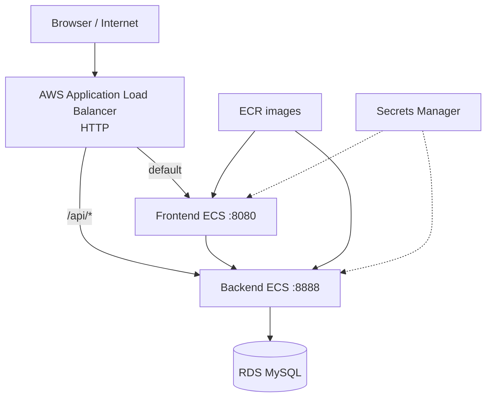

# Verified scope

## Architecture defined in source code

The Terraform source defines a VPC, public/private data subnets, security groups, ALB, ECS Fargate, ECR, RDS MySQL, S3, Secrets Manager, and CloudWatch Logs in `ap-southeast-1`. This is a source-code description and is not used to claim that every resource is currently healthy without a matching AWS query.

## Directly observed

- The public ALB DNS returned the homepage and statistics API with HTTP `200`.
- The `main` workflow completed backend tests, frontend tests, Terraform validation, image build/push, and ECS deployment.
- The checked URL uses HTTP; there is no evidence of HTTPS or a custom domain.

## Evidence not available

- Step-by-step AWS Console screenshots.
- k6 output and actual p95/error-rate metrics.
- Total manual time from start to completion.
- Cost from the correct deployment account/environment.
