# Overview

## Learning objectives

After this workshop, you can:

- Run Maven tests and both EduFlow applications locally.
- Build non-root Java 17 containers.
- Provision VPC, security groups, ALB, ECR/ECS, RDS, S3, and Secrets Manager with Terraform.
- Push images to ECR and run two Fargate services.
- Inspect target health, CloudWatch logs, and application journeys.
- Safely remove workshop resources.

## Architecture

```mermaid
flowchart TB
    Internet["Browser / Internet"] --> ALB["Application Load Balancer\nHTTP 80 / HTTPS 443"]
    subgraph VPC["EduFlow VPC - ap-southeast-1"]
      subgraph Public["Public subnets - 2 AZ"]
        ALB
        FE["Frontend Fargate\nJava 17 :8080"]
        BE["Backend Fargate\nJava 17 :8888"]
      end
      subgraph PrivateData["Private data subnets - 2 AZ"]
        DB[("RDS MySQL 8")]
      end
      ALB -->|"default"| FE
      ALB -->|"/api/*"| BE
      FE --> BE
      BE --> DB
    end
    SM["Secrets Manager"] -.-> FE
    SM -.-> BE
    ECR["ECR repositories"] --> FE
    ECR --> BE
    FE --> CW["CloudWatch Logs"]
    BE --> CW
```

## Flow

1. Prepare tools and an AWS account.
2. Test the backend/frontend locally.
3. Configure Terraform inputs and secrets.
4. Bootstrap ECR, then build and push images.
5. Apply the complete infrastructure and verify services.
6. Enable CI/CD and clean up after the lab.

Estimated time: **90-150 minutes**, excluding image downloads and RDS provisioning.
