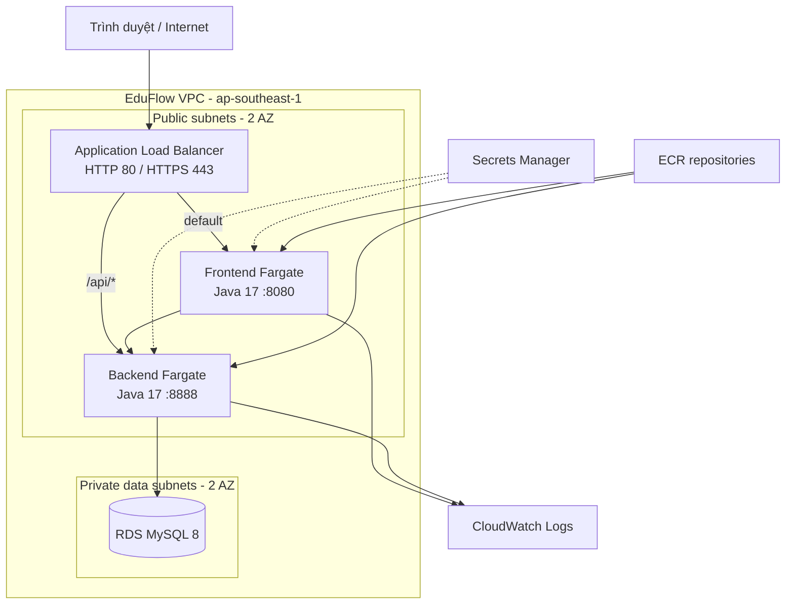

# Tổng quan

## Mục tiêu học tập

Sau workshop, bạn có thể:

- Chạy test Maven và hai ứng dụng EduFlow tại local.
- Build container Java 17 không chạy bằng tài khoản root.
- Dùng Terraform tạo VPC, security groups, ALB, ECR/ECS, RDS, S3 và Secrets Manager.
- Đẩy image lên ECR và chạy hai Fargate service.
- Kiểm tra target health, log CloudWatch và luồng ứng dụng.
- Dọn tài nguyên an toàn sau khi hoàn tất.

## Kiến trúc

## Luồng thực hiện

1. Chuẩn bị công cụ và AWS account.
2. Chạy test/backend/frontend ở local.
3. Cấu hình biến Terraform và secret.
4. Bootstrap ECR, build và push image.
5. Apply hạ tầng đầy đủ, kiểm tra dịch vụ.
6. Kích hoạt CI/CD và dọn tài nguyên khi kết thúc.

Thời gian dự kiến: **90-150 phút**, chưa tính thời gian tải Docker image hoặc chờ RDS.
