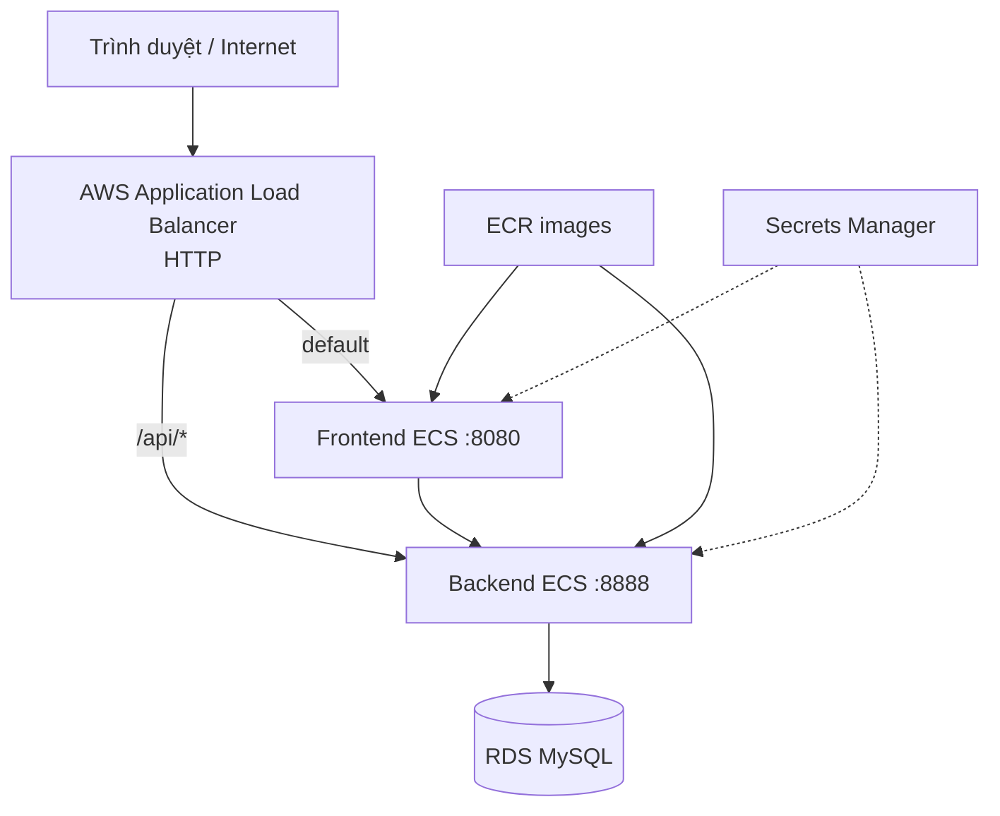

# Phạm vi đã xác minh

## Kiến trúc có trong mã nguồn

Mã Terraform định nghĩa VPC, public/private data subnet, security group, ALB, ECS Fargate, ECR, RDS MySQL, S3, Secrets Manager và CloudWatch Logs tại `ap-southeast-1`. Đây là mô tả từ mã nguồn; không dùng nó để khẳng định từng resource đang hoạt động nếu chưa có kết quả truy vấn AWS tương ứng.

## Phần đã quan sát trực tiếp

- DNS ALB công khai phản hồi trang chủ và API thống kê bằng HTTP `200`.
- Workflow trên nhánh `main` hoàn tất backend test, frontend test, Terraform validation, build/push image và ECS deployment.
- Smoke test trình duyệt xác minh trang công khai, chuyển Việt–Anh và redirect
  người chưa đăng nhập sang trang đăng nhập khi bắt đầu mua khóa học.
- K6 hoàn thành 1.758 request với 50 VU, tỷ lệ lỗi 0,00% và p95 1,84 giây.
- URL đang dùng HTTP; chưa có bằng chứng HTTPS hoặc custom domain.

## Phần chưa có bằng chứng

- Ảnh từng bước trong AWS Console.
- Tổng thời gian thao tác thủ công từ lúc bắt đầu đến khi hoàn tất.
- Chi phí của đúng tài khoản/môi trường triển khai.
- Kiểm thử đăng nhập đầy đủ cho ba vai trò và thanh toán VNPay end-to-end.
